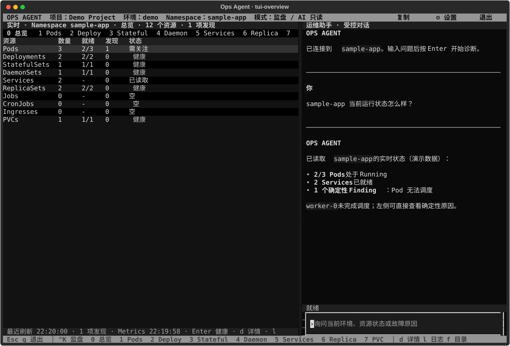
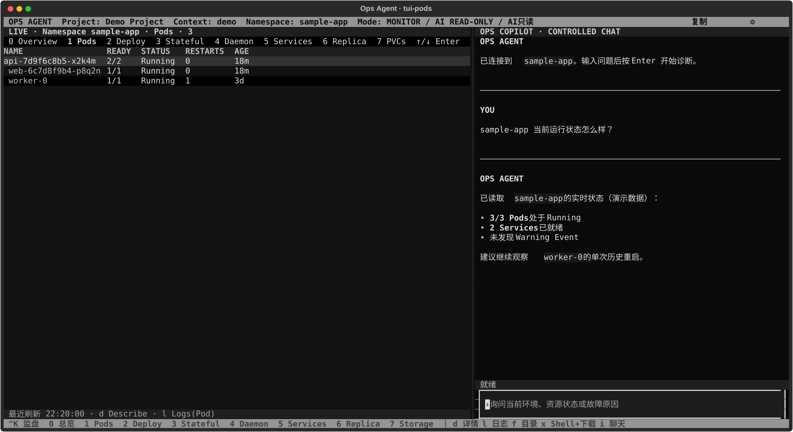
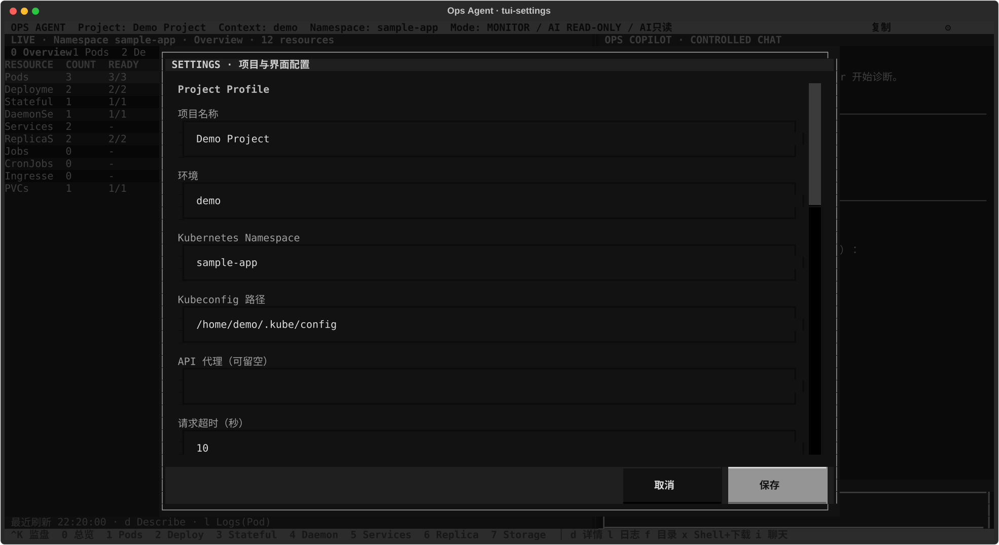
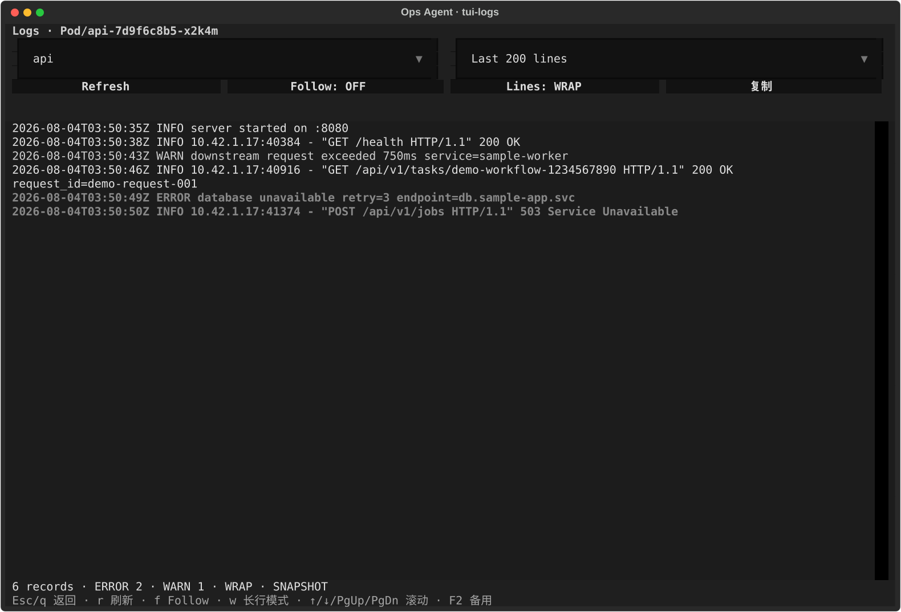

# ops_agent

面向 Kubernetes 场景的智能运维 Agent。项目目标是把告警、集群状态和运维知识转化为可解释、可审计、可审批的诊断与处置流程，帮助运维人员缩短故障定位和恢复时间。

> [!IMPORTANT]
> 项目目前处于早期开发阶段。当前已打通 Kubernetes TOML 配置、
> 八项 Kubernetes 只读工具、可选 Metrics API 监盘、LangGraph 主/子 Agent 和
> CLI 自然语言查询链路；告警接入和自动处置等能力仍在规划中。

> [!NOTE]
> Ops Agent 始终作为本地终端监控工具运行，不向目标集群安装 Operator、CRD、
> DaemonSet、Exporter、metrics-server、Prometheus 或其他工作负载。可选数据源
> 只读取环境中已经存在的接口；缺失或无权限时显示 `Unavailable` 并降级运行。

## 项目目标

- **统一运维入口**：通过自然语言查询集群、工作负载、事件和告警。
- **辅助故障诊断**：汇总上下文，形成带证据的根因假设与处理建议。
- **安全执行变更**：高风险操作必须经过审批，并支持预检、超时和回滚。
- **全程可审计**：记录输入、工具调用、决策依据、执行结果和操作人员。
- **环境相互隔离**：开发、测试和生产环境使用独立配置及最小权限凭据。

## 当前能力

| 能力 | 状态 | 说明 |
| --- | --- | --- |
| TOML 配置加载 | 已完成 | 从指定文件加载 Kubernetes 配置 |
| 配置错误处理 | 已完成 | 识别文件缺失、TOML 格式错误、区块、字段缺失或未知字段 |
| 不可变配置模型 | 已完成 | 使用冻结的 Pydantic 模型声明类型、别名和字段约束 |
| Kubernetes 只读查询 | 已完成 | 查询常用工作负载、网络入口、PVC、Pod 详情/日志和关联 Event |
| Kubernetes 实时指标 | 已完成 | 可选读取集群已有 Metrics API，在 Pod 监盘显示 CPU/Memory；缺失或无权限时独立降级 |
| PVC 存储浏览 | 已完成 | 展示 PVC/PV/StorageClass/后端/挂载关系，并经现有 Pod 只读浏览目录和预览文本文件 |
| Artifact Download | 已完成 | 从选定 Pod 或 PVC 流式下载普通文件，显示大小与 SHA-256，失败自动清理 |
| Interactive Pod Session | 已完成 | 左侧监盘人工进入选定 Pod/容器；默认禁用且不向 Agent 暴露 |
| Kubernetes 基础诊断 | 已完成 | Agent 可确定性识别 Pod 失败原因、资源不足调度、资源压力驱逐、Deployment rollout、Service→Endpoint→Pod 与工作负载资源关系 |
| 告警接入与诊断 | 规划中 | 接入告警并生成带证据的诊断报告 |
| 审批与处置执行 | 规划中 | 执行扩缩容、重启、回滚等受控动作 |
| LLM / Agent 编排 | 基础已完成 | 受控主图负责范围路由和诊断计划，Kubernetes 子图负责只读诊断 |
| CLI 自然语言入口 | 已完成 | 使用 `ops-agent ask` 查询真实集群状态 |
| 交互式终端 | 基础已完成 | 左侧直接呈现确定性 Finding、健康原因和 Deployment 资源拓扑；右侧保留受控多轮对话 |
| 审计与可观测性 | 规划中 | 结构化日志、Tracing、指标和操作审计 |

## 界面预览

以下截图由本地 Textual 应用使用完全虚构的 `demo` 环境和 `sample-app`
资源生成，不包含真实集群地址、资源名称、路径或凭据。
界面默认采用简体中文，Kubernetes 固有名词和日志级别保留英文；完整约定见
[界面语言规范](docs/ui-language.md)。

### 资源总览与受控对话



### Pods 实时监盘



### 项目与界面设置



### Pod 日志工作台



## 技术栈

- Python 3.12+（仅源码开发需要；GitHub Release 已内置运行时）
- LangChain / LangGraph
- Kubernetes Python Client
- Pydantic
- Textual
- TOML（Python 标准库 `tomllib`）
- pytest
- uv（推荐的依赖与虚拟环境管理工具）

## 安装版快速开始

普通用户不需要克隆仓库，也不需要安装 Python 或 uv。macOS 与 Linux
优先通过 Homebrew 安装：

```bash
brew tap Chengyunlai/tap
brew install ops-agent
```

也可以从 GitHub Releases 下载与本机匹配的压缩包：

```text
ops-agent_<version>_darwin-arm64.tar.gz
ops-agent_<version>_darwin-amd64.tar.gz
ops-agent_<version>_linux-amd64.tar.gz
```

例如 macOS arm64 用户可以解压到个人应用目录，并为两个兼容命令建立链接：

```bash
mkdir -p ~/.local/bin
mkdir -p ~/.local/share/ops-agent
tar -xzf ops-agent_0.1.0_darwin-arm64.tar.gz
cp -R ops-agent_0.1.0_darwin-arm64/. ~/.local/share/ops-agent/
ln -sf ~/.local/share/ops-agent/ops-agent ~/.local/bin/ops-agent
ln -sf ~/.local/share/ops-agent/ops-agent ~/.local/bin/ops_agent
```

确保 `~/.local/bin` 已加入 `PATH`，然后创建初始 Project Profile：

```bash
ops-agent --version
ops-agent init
ops-agent config path
```

默认配置位于 `~/.config/ops-agent/config.toml`。路径解析优先级为：

1. 命令行 `--config`；
2. 环境变量 `OPS_AGENT_CONFIG`；
3. `$XDG_CONFIG_HOME/ops-agent/config.toml`；
4. `~/.config/ops-agent/config.toml`。

编辑配置并设置模型密钥后，先运行安装诊断：

```bash
export OPENAI_API_KEY="..."
ops-agent doctor
ops-agent tui
```

`doctor` 会检查配置、kubeconfig、模型密钥环境变量、固定 namespace 的 Pod
读取权限和 `kubectl`。未安装 `kubectl` 只影响 Interactive Pod Session 和
Pod Artifact Download；如果配置显式启用了 Interactive Pod Session，则
缺少 `kubectl` 会被视为失败。

每个 Release 同时发布 `SHA256SUMS` 和 GitHub build provenance。当前支持
macOS 与 Linux；终端 PTY 实现依赖 Unix `termios`/`fcntl`，暂不提供 Windows
安装包。Homebrew 是 macOS 的主要安装入口，GitHub Release 独立程序作为
回退方式；当前终端工具发布方式不要求 Apple Developer 签名。

## 源码开发

### 1. 获取项目

```bash
git clone https://github.com/Chengyunlai/ops-agent.git
cd ops_agent
```

### 2. 安装依赖

推荐使用 [uv](https://docs.astral.sh/uv/)：

```bash
uv sync
```

项目使用 uv workspace 管理本地成员及其依赖，请在仓库根目录通过 uv
安装和运行。

### 3. 创建本地配置

仓库在 `config/examples/` 提供可提交的环境模板。复制需要的模板到
已被 Git 忽略的 `config/local/`，再填写本机 kubeconfig：

```bash
mkdir -p config/local
cp config/examples/test.toml config/local/test.toml
```

本地配置内容如下；不要在其中保存访问令牌、证书等敏感信息：

```toml
[project]
name = "Operations"

[project.log_focus]
hide_info = false
hide_debug = false
hide_health_checks = false
hide_access_logs = false
hidden_text = []

[kubernetes]
environment = "local"
namespace = "operations"
kubeconfig_path = "/absolute/path/to/.kube/config"
request_timeout_seconds = 10

[kubernetes.watch]
enabled = true
timeout_seconds = 10
poll_interval_seconds = 5.0

[kubernetes.metrics]
enabled = true
request_timeout_seconds = 3
cache_ttl_seconds = 10.0

[kubernetes.interactive_exec]
enabled = false
locale = "auto"
terminal_type = "xterm-256color"
color = true

[kubernetes.downloads]
directory = "~/Downloads/ops-agent"

[kubernetes.pod_transfer]
strategy = "auto"
max_file_size_mb = 512

[model]
provider = "openai"
model = "deepseek-v4-pro"
base_url = "https://api.deepseek.com"
api_key_env = "DEEPSEEK_API_KEY"

[tui]
theme = "ops-dark"

[tui.colors]
# primary = "#1FB5AD"
# accent = "#FFCC66"
```

这里使用 DeepSeek 官方提供的 OpenAI-compatible 接口，所以
`provider` 填写 LangChain 适配器名称 `openai`。模型密钥只通过环境变量提供：

```bash
export DEEPSEEK_API_KEY="..."
```

`model` 必须支持工具调用。配置文件中不要保存 API Key。

配置项说明：

| 配置项 | 类型 | 说明 |
| --- | --- | --- |
| `project.name` | string | Project Profile 的显示名称 |
| `project.log_focus.hide_info` | boolean | Focus 启用时是否隐藏 INFO；默认 `false` |
| `project.log_focus.hide_debug` | boolean | Focus 启用时是否隐藏 DEBUG；默认 `false` |
| `project.log_focus.hide_health_checks` | boolean | Focus 启用时是否隐藏健康检查；默认 `false` |
| `project.log_focus.hide_access_logs` | boolean | Focus 启用时是否隐藏 HTTP 访问日志；默认 `false` |
| `project.log_focus.hidden_text` | string array | 操作员维护的大小写不敏感原文隐藏规则；最多 50 条，每条最多 200 字符 |
| `environment` | string | 环境标识，例如 `dev`、`test`、`prod` |
| `namespace` | string | Agent 默认访问的 Kubernetes 命名空间 |
| `kubeconfig_path` | string | kubeconfig 路径，推荐使用绝对路径 |
| `request_timeout_seconds` | integer | Kubernetes API 请求超时时间（秒） |
| `proxy_url` | HTTP(S) URL | 可选；访问 Kubernetes API 使用的代理，例如 `http://127.0.0.1:7897` |
| `kubernetes.watch.enabled` | boolean | 是否用 Kubernetes Watch 加速监盘刷新；默认 `true` |
| `kubernetes.watch.timeout_seconds` | integer | 单次只读 Watch 请求的服务端超时；默认 `10` 秒 |
| `kubernetes.watch.poll_interval_seconds` | number | 完整快照一致性兜底及 Watch 不可用时的轮询间隔；默认 `5.0` 秒 |
| `kubernetes.metrics.enabled` | boolean | 是否读取集群已经存在的 `metrics.k8s.io` Pod 指标；默认 `true`，不会安装 metrics-server |
| `kubernetes.metrics.request_timeout_seconds` | integer | 单次 Metrics API 请求超时，范围 `1`～`30` 秒；默认 `3` 秒 |
| `kubernetes.metrics.cache_ttl_seconds` | number | 成功指标快照的本地缓存时间，范围 `1.0`～`300.0` 秒；默认 `10.0` 秒 |
| `kubernetes.interactive_exec.enabled` | boolean | 是否允许左侧监盘启动人工 Pod Shell；默认 `false` |
| `kubernetes.interactive_exec.locale` | string | Pod Shell UTF-8 locale；`auto` 自动探测，默认 `auto` |
| `kubernetes.interactive_exec.terminal_type` | string | Pod Shell 的 `TERM` 值；默认 `xterm-256color` |
| `kubernetes.interactive_exec.color` | boolean | 若容器的 `ls` 支持颜色参数，是否自动启用彩色目录；默认 `true` |
| `kubernetes.downloads.directory` | path | Pod/PVC 文件下载的本机根目录；默认 `~/Downloads/ops-agent` |
| `kubernetes.pod_transfer.strategy` | enum | Pod 文件传输策略：`auto`、`exec-cat` 或 `exec-dd`；默认 `auto` |
| `kubernetes.pod_transfer.max_file_size_mb` | integer | 单个 Pod 文件下载上限（MiB）；默认 `512` |
| `model.provider` | string | LangChain 模型适配器；DeepSeek 兼容接口使用 `openai` |
| `model.model` | string | 供应商提供的、支持工具调用的模型名称 |
| `model.base_url` | string | 可选的模型接口地址 |
| `model.api_key_env` | string | 保存 API Key 的环境变量名称 |
| `tui.theme` | enum | `ops-dark`、`light` 或 `high-contrast` |
| `tui.colors.primary` | `#RRGGBB` | 可选的主题主色覆盖 |
| `tui.colors.accent` | `#RRGGBB` | 可选的主题强调色覆盖 |
| `tui.colors.background` | `#RRGGBB` | 可选的主题背景色覆盖 |
| `tui.colors.foreground` | `#RRGGBB` | 可选的主题文字色覆盖 |
| `tui.colors.warning` | `#RRGGBB` | 可选的主题警告色覆盖 |

当前加载器校验配置文件、TOML 格式、`[kubernetes]` / `[model]`
区块、字段类型、正整数超时、Watch 开关与正数轮询间隔、Metrics 开关、请求
超时和缓存范围、可选代理 URL、
人工终端开关、Shell locale、终端类型、颜色开关、下载目录、Pod 传输策略、
文件大小上限、主题名称和十六进制颜色；
kubeconfig 是否存在由创建 Kubernetes Client 时检查。`proxy_url` 由配置
模型校验并在 Kubernetes Client 创建前注入，因此不依赖启动 Shell 是否
继承 macOS 系统代理。

当前可通过 Python API 加载配置：

```python
from pathlib import Path

from ops_agent_cli.configuration import load_settings

settings = load_settings(Path("config/local/test.toml"))
print(
    settings.kubernetes.environment,
    settings.kubernetes.namespace,
)
```

### 4. 查询真实集群

```bash
uv run ops-agent \
  --config config/local/test.toml \
  ask "检查所有 Pod，指出非 Running 或发生过重启的 Pod"
```

Agent 使用配置中固定的 kubeconfig 和 namespace。模型不能通过工具参数
切换环境或 namespace。

当前 Agent 可以按需调用以下只读工具：

| 工具 | 用途 | 查询边界 |
| --- | --- | --- |
| `diagnose_kubernetes_workloads` | 确定性诊断 Pod 资源压力、Deployment rollout/所属 ReplicaSet 与 Pod、Service Endpoint | 配置中的 namespace |
| `list_kubernetes_pods` | 查看 Pod 阶段、就绪容器数和重启数 | 配置中的 namespace |
| `get_kubernetes_pod_details` | 查看 Pod 节点、IP、镜像和容器状态 | 指定 Pod |
| `get_kubernetes_pod_logs` | 读取 Pod 当前或上一个容器实例日志（`previous=true`） | 最多 1000 行 |
| `list_kubernetes_events` | 查看 namespace 或指定 Pod 的 Event | 最多 200 条 |
| `list_kubernetes_deployments` | 查看 Deployment 期望与就绪副本数 | 配置中的 namespace |
| `list_kubernetes_services` | 查看 Service 类型、ClusterIP 和端口 | 配置中的 namespace |
| `list_kubernetes_service_endpoints` | 按 Service 聚合 Endpoint 来源、Ready 状态和 targetRef/Pod 关系 | 配置中的 namespace |

这些工具没有接收环境或 namespace 参数，也没有暴露通用 `kubectl` 或
Shell 执行入口。这样可以把模型的活动范围限制在启动时选定的配置内。宽泛的
工作负载健康检查会先调用确定性诊断工具，再由受控代码按 Finding 查询 Event
和 previous logs；是否执行这些强制取证不再由 Prompt 决定。
强制取证由稳定的 Finding code 选择，不依赖可翻译、可调整的中文 summary；
采集结果以独立 ToolMessage 数据角色交给模型，不会拼入用户问题。
Pod Observation 同时保留容器当前/上一次状态、reason、exit code 和调度 Condition；
遇到 CrashLoopBackOff 或 OOMKilled 时，专业 Agent 可按 Finding 中的 Pod/容器名
读取关联 Event 和上一个容器实例日志，不会把模型猜测当成失败原因。
Pod Observation 还保留 status reason/message、QoS class 和每个容器声明的
CPU、内存及 ephemeral-storage requests/limits。调度器明确报告
`insufficient cpu`、`insufficient memory`、`insufficient ephemeral-storage`
或节点明确报告资源压力驱逐时，会生成稳定 Finding；人工维护驱逐不会被误判。
这些值来自现有 Pod spec/status，不代表实时使用率，也不需要 Metrics API。
Deployment Observation 保留 generation、observedGeneration、revision 和 Conditions；
rollout 超过 progress deadline 时，Finding 会按 controller owner 附带所属
ReplicaSet 和 Pod，而不是根据名称前缀推测关系。诊断所用只读 RBAC 需要允许
目标 namespace 的 `apps/deployments` 与 `apps/replicasets` 执行 `list`。
Service 诊断使用 `discovery.k8s.io/v1` EndpointSlice，并保留来源类型、每个
地址的 Ready 状态和 `targetRef`，因此可以形成 Service → Endpoint → Pod
Evidence；只读 RBAC 除 Service 权限外，还必须允许在目标 namespace 对
`endpointslices` 执行 `list`。该权限
缺失时查询会返回明确错误，不会把权限失败误判为 Service 没有后端。
如果集群明确返回 EndpointSlice API 404，Reader 会回退到 CoreV1 Endpoints；
403 权限错误不会触发回退。

### 5. 启动交互式终端

```bash
uv run ops-agent \
  --config config/local/test.toml \
  tui
```

TUI 显示当前环境、固定 namespace 和 AI 只读标识。宽终端采用左右布局：左侧
先读取完整快照，再从该快照的 Pod `resourceVersion` 启动只读 Kubernetes
Watch；Pod 变化会立即使完整快照失效并刷新。Watch 超时会正常重连，API 不可用、
网络断开或 RBAC 403 时自动保留每 5 秒完整轮询，不会安装组件、提升权限或影响
人工 Pod 操作。默认“总览”明确列出 Pod、Deployment、StatefulSet、
DaemonSet、Service、ReplicaSet、Job、CronJob、Ingress 和 PVC 的数量、
Finding 数与状态；具体资源表紧邻名称显示 `OK` 或 `WARN · 原因`。右侧保留
本次运行中的用户消息和 Agent Markdown 回复。窄终端自动改为
上下布局。启用 `[kubernetes.metrics]` 后，Pod 表追加当前 CPU、Memory；底部
显示指标采样时间。Metrics API 不存在、无权限或暂时不可用时显示
`Metrics 不可用`，Pod 与其他资源清单继续正常刷新。每类资源独立查询，
单类 API 或 RBAC 失败会在该行显示
`不可用`，不会让 Pod、Service 等其他目录一起消失。

`Ctrl+K` 聚焦左侧监盘，`0` 返回“总览”，`1`～`7` 切换具体资源；
“总览”中可用方向键和 `Enter` 进入任意资源类型。选中资源后按
`Enter` 或 `h` 打开最新确定性 Finding 和 Evidence；Deployment 还会显示
generation、observedGeneration、revision、Conditions，以及只按 controller
owner 构建的 Deployment → ReplicaSet → Pod 拓扑。`d` 读取原始对象详情与
关联 Event；Pod 上按 `l` 进入全屏日志工作台。工作台可选择单个或全部容器，
以及最近 200、500、1000 行或最近 15 分钟、1 小时；全部容器视图会标记来源，
且单个容器读取失败不会遮蔽其他容器。默认保留完整 Log Snapshot 并对长行自动
换行，按 `w` 可在换行、按当前视口截断和完整水平查看之间切换。ERROR、WARN、
完整异常栈和 HTTP 4xx/5xx 使用当前主题的语义色突出显示。
选择单个容器后，按 `f` 开启或停止只读“实时跟随”（Log Follow）；新记录追加在
原始快照之后，
只抑制 Follow 开始时 Kubernetes API 重放的快照边界记录，不会合并后续相同事件。
Follow 最多保留 10,000 条追加记录，达到上限时会停止并明确提示未追加记录；
流中断会保留已有内容并显示重连或返回选择重建后 Pod 的操作。日志读取和 Follow
都直接使用 Kubernetes API，不依赖 Pod Shell、不安装采集组件，也不把操作交给
AI。

“日志聚焦”（Log Focus）默认关闭，原始 Log Snapshot 和 Follow 缓冲始终保留。
点击 INFO、DEBUG、“健康检查”或“访问日志”按钮会显式启用日志聚焦，并把操作员
选择保存到当前 Project Profile；“规则”可维护最多 50 条大小写不敏感的明确文本
隐藏规则。AI
不能选择、生成或应用这些规则。按 `/` 聚焦本地搜索，`n` 和 `Shift+N` 跳转
下一个或上一个命中；搜索默认忽略大小写，可切换“正则”。界面始终显示当前
Focus、可见/隐藏记录数、搜索模式、命中总数和当前位置，无结果或无效正则也会
明确提示。过滤与搜索只在本地重算视图，不会重新请求 Kubernetes；Follow 新记录
会进入同一套 Focus 与搜索计算。
实时 CPU/Memory 只由
确定性的本地 Monitor 读取，不注册为 Agent Tool，也不会由模型猜测；历史指标
时间线仍需已有 Prometheus 等外部数据源才可能提供。

Service 的“健康诊断”详情会显示数据来源（EndpointSlice 或旧版 Endpoints）、
Ready/NotReady 数量和 Endpoint → Pod targetRef；健康 Service 也可以查看该关系，
不必先出现 Finding。

如果 EndpointSlice 查询失败，Service 清单仍然保留，但监盘会明确标记
`诊断不完整`，不会把权限失败或 API 失败误判成“Service 没有后端”。

`7` 进入 PVC 视图，表格展示 PVC、PV、容量、StorageClass、NFS/CSI
等后端类型，以及实际挂载它的 Pod、容器和 `mountPath`。选中 PVC 后按
`Enter` 或 `f` 打开只读目录浏览器；目录中 `Enter` 进入子目录或预览普通
文本文件，`Backspace` 返回上级目录，`r` 刷新。文件预览最多读取 64 KiB，
读取时使用逐级 `O_NOFOLLOW` 文件描述符约束，不跟随符号链接，也拒绝绝对
路径和 `..` 路径；当前不会创建辅助 Pod，也不会新增、修改、移动或删除卷内
文件。

PVC 浏览器选中普通文件后按 `s`，会将文件下载到配置根目录下的
`environment/namespace/PVC/claim/...`。Pod 文件不再要求进入会话前填写绝对
路径；进入 Interactive Pod Session 后先使用 `cd`、`ls`、`find` 定位文件，
再执行 `download <文件>`。相对路径基于当前容器工作目录解析，文件保存到
`environment/namespace/Pod/pod/container/...`，下载完成后仍停留在同一个
Shell。主机显示解析后的绝对路径；按 `y` 确认后才开始传输，防止容器输出
伪造下载请求。

下载使用同目录 `.part` 临时文件和原子发布；已有同名文件不会被覆盖，而是
增加时间戳。完成后当前界面显示最终路径、字节数和完整 SHA-256。传输通过
固定读取脚本流式执行，不会把用户输入拼入 Shell 命令。Pod 文件读取只要求
容器具备 POSIX `sh`，以及 `cat` 或 `dd`，不要求安装 Python；PVC 文件仍
使用 Python 读取器维持挂载根目录和符号链接边界。

`pod_transfer.strategy = "auto"` 会先探测目标容器，再优先选择
`exec-cat`，缺少 `cat` 时回退到 `exec-dd`。下载完成信息会显示实际后端；
两者都不可用时直接说明缺失工具和当前策略。主机在流式读取时执行
`max_file_size_mb` 上限，超限会终止 kubectl 并删除 `.part` 文件。显式选择
`exec-cat` 或 `exec-dd` 可用于固定环境和故障诊断。

Pods 表格选中 Pod 后按 `x` 可启动 **Interactive Pod Session**。该功能默认
关闭，必须在 `[kubernetes.interactive_exec]` 中显式启用并重启 TUI；进入前
还要选择容器并确认实际写入风险。会话期间 TUI 让出终端并明确显示人工写访问
模式；kubectl 接管终端前还会打印包含环境、namespace、Pod、容器和写风险的
横幅。会话会在容器 `/tmp` 创建仅本次有效的 `download` 辅助命令，退出时
清理；异常断开时本机还会按随机会话标识执行兜底清理。该命令通过带随机令牌
的终端协议请求本机执行只读传输。会话期间暂停后台监盘刷新，退出 Shell 后
恢复，避免 Kubernetes TLS 警告污染终端。该入口只属于左侧人工操作，不注册
为 LangChain Tool、不进入主图或子 Agent，也不会把 Shell 命令交给模型。

会话默认以 `locale = "auto"` 探测目标容器现有 locale 及
`C.UTF-8`、`C.utf8`、`en_US.UTF-8`、`zh_CN.UTF-8` 等常见 UTF-8 选项，
避免中文文件名被 `ls` 显示为八进制转义。没有可用 UTF-8 locale 时会明确
警告，此时需要在容器镜像中安装 locale；Ops Agent 不会修改镜像。
`terminal_type` 默认设为 `xterm-256color`，`color = true` 时仅在容器
`ls --color=auto` 可用的情况下为本次 Shell 增加颜色 alias。三个选项也可在
顶部“设置”的“人工 Pod 访问”区域修改，保存后重启生效。

Interactive Pod Session 及其下载命令要求目标容器包含 POSIX `sh`，并包含
`cat` 或 `dd`；不要求 Python 或 `base64`。PVC 目录浏览和 PVC 文件下载还
要求 PVC 已挂载到 Running 容器并包含 Python 3。kubeconfig/RBAC 至少需要读取
namespace 内 Pod/PVC、读取集群级 PV，并允许连接 `pods/exec` 子资源（不同
集群可能要求 `get`/`create`）。PVC 未挂载、容器为 distroless、缺少对应
读取工具或权限不足时，界面会显示明确错误，并尝试同一 PVC 的其他 Running
挂载目标；不会创建临时工作负载。

实时 Pod CPU/Memory 只需要目标 namespace 对 `metrics.k8s.io` 的 `pods`
拥有 `list` 权限，并且集群已经提供 Metrics API。可以先运行
`kubectl auth can-i list pods.metrics.k8s.io -n <namespace>` 检查权限。
缺少 API 或权限只会让指标显示为“不可用”；Ops Agent 不会安装
`metrics-server`、创建 ServiceAccount 或申请更高权限。若不需要指标，可在
“设置”中禁用，或设置 `kubernetes.metrics.enabled = false`。

TUI 启用鼠标以支持点击聚焦；复制终端内容时点击顶部“复制”
（`F2` 也可作为备用快捷键）进入复制模式，应用会释放终端鼠标，此时可以
直接拖选任意内容并使用终端复制快捷键；复制完成后按 `Esc` 恢复仪表盘
鼠标控制。

顶部“设置”（或 `Ctrl+,`）编辑当前 Project Profile、集群连接、Watch、
Metrics API、人工 Pod 访问、下载目录、主题和颜色。主题
选择与有效颜色会即时预览；保存后写回启动时使用的 TOML。项目名称、环境、
namespace、kubeconfig、代理和请求超时属于运行边界，保存后需要重启应用才会
生效；人工终端开关与下载目录也在重启后生效；主题与颜色无需重启。内置
`ops-dark`、`light`、`high-contrast`
三个主题，也可恢复预设默认颜色。

这些固定操作直接使用绑定 namespace 的 Monitor/Reader，不经过 Agent，也不
读取或改变右侧 Conversation Session。`i` 返回聊天输入，`Ctrl+R` 立即刷新
监盘，`Ctrl+L` 清空右侧显示但保留会话上下文，`F1`/`?` 显示帮助，
`Ctrl+C` 在任意焦点下退出。

右侧虽然采用普通聊天交互，但仍将可信 `InteractionContext` 传给主图并消费
受控 `ConversationSession`，不是绕过 Policy 的裸模型入口。因此可以使用
“现在几个服务”这类上下文简称，无需反复声明 Kubernetes 和 namespace；
会话历史会传给 Planner 和专业 Agent，澄清确认与指代式追问不会在执行阶段
丢失上下文。原有 `ops-agent ask` 非交互入口保持不变，并继续采用保守的
自动 scope。

### 6. 开发命令

仓库根目录的 Makefile 统一封装 uv、Ruff 和 pytest：

```bash
make help
make sync
make format
make check
make test-cli
make test-runtime
make test-kubernetes-integration
make tui CONFIG=config/local/test.toml
make package
make release TARGET=darwin-arm64
```

`make format` 自动修复 Ruff 问题并格式化代码，`make check` 检查 GitHub Action
是否固定到完整 commit SHA，并运行静态检查、格式检查和不依赖外部集群的
全量测试。

`main` 只接受 Pull Request。PR 必须通过仓库策略、依赖审查、Python 3.12 / 3.14
测试、Secret scan、构建和 kind 集成测试，并完成 CODEOWNER 审核与讨论处理后
才能合并。
机器人检查只提供可重复的策略与测试结论；架构、安全边界、权限变化和发布
仍由维护者审核。当前未配置 AI Reviewer；未来若启用，也只能发表评论，不能
批准、合并、推送或发布。完整规则见 [CONTRIBUTING.md](CONTRIBUTING.md)，安全问题使用
[私密报告流程](SECURITY.md)。

Kubernetes 集成测试只允许显式选择的临时 kind context，并会创建后删除
`ops-agent-diagnostics-e2e` namespace。它不会在普通 `make check` 中运行：

```bash
OPS_AGENT_KUBERNETES_INTEGRATION=1 \
OPS_AGENT_KUBERNETES_CONTEXT=kind-ops-agent-ci \
KUBECONFIG=/path/to/disposable-kind-kubeconfig \
make test-kubernetes-integration
```

单元测试固定覆盖 Metrics API 缺失/403 的独立降级、响应解析和本地缓存。
Kubernetes 集成测试夹具固定覆盖 Pod Watch 变化与 Watch RBAC 403 回退、
Service 无 Endpoint、Service → Endpoint → Pod、
CrashLoopBackOff、ImagePullBackOff、Deployment progress deadline、EndpointSlice
RBAC 403，以及模拟 Discovery 404 后读取真实 CoreV1 Endpoints 的回退链路；
fixture 会拒绝非 `kind-` context 或 current context 不匹配的配置。CI 会自动
创建独立 kind 集群。

也可以直接运行测试：

```bash
uv run pytest
```

### 7. 发布

应用版本由 `ops_agent_cli.__version__` 提供，CLI wheel 通过 Hatch 从同一
位置读取；`make bump-version VERSION=x.y.z` 是唯一版本升级入口，会同步
workspace 发行元数据并更新 lockfile，测试也会校验它们没有漂移。推送
位于 `main` 的 `v<version>` 标签后，`.github/workflows/release.yml` 会：

1. 验证 SemVer 标签属于 `main`，并重新运行完整检查；
2. 在 macOS arm64、macOS amd64 和 Linux amd64 原生 Runner 构建；
3. 验证标签版本与 `ops-agent --version` 完全一致；
4. 对独立应用包执行配置初始化和 OpenAI-compatible Provider 加载冒烟测试；
5. 生成包含目录式运行时、配置示例、README 和 Apache-2.0 LICENSE 的
   `tar.gz`；
6. 等待 `release` Environment 的人工批准；
7. 汇总 `SHA256SUMS`、生成 GitHub provenance 并创建 Release。

本机可以使用 `make package` 构建 `dist/ops-agent`；使用
`make release TARGET=<platform-arch>` 生成与 GitHub 相同结构的压缩包。
发布目录、PyInstaller 构建目录和应用包均被 Git 忽略。目录式运行时避免
单文件程序每次启动时重复解压完整依赖。

公开发布采用两个仓库：`Chengyunlai/ops-agent` 保存源码和 Release，
`Chengyunlai/homebrew-tap` 保存 Homebrew Formula。Release 发布完成后，
Tap 仓库的更新工作流会读取最新版本与 `SHA256SUMS`，生成三个平台对应的
Formula；不需要在主仓库存储跨仓库写权限令牌。

## 许可证

本项目采用 [Apache License 2.0](LICENSE)。

## 项目结构

```text
ops_agent/
├── .github/workflows/              # CI 与标签发布
├── packaging/
│   └── ops-agent.spec              # PyInstaller 独立应用包描述
├── scripts/
│   ├── create_release_archive.py
│   └── write_release_checksums.py
├── CONTEXT.md
├── Makefile
├── config/
│   ├── examples/                  # 可提交的配置模板
│   │   ├── dev.toml
│   │   ├── prod.toml
│   │   └── test.toml
│   └── local/                     # 本机配置，Git 忽略
│       └── test.toml
├── apps/
│   └── cli/
│       ├── src/
│       │   └── ops_agent_cli/
│       │       ├── __init__.py
│       │       ├── __main__.py
│       │       ├── bootstrap.py
│       │       ├── configuration/
│       │       │   ├── models.py
│       │       │   └── persistence.py
│       │       ├── installation.py
│       │       ├── main.py
│       │       ├── manual_access/
│       │       │   ├── kubectl.py
│       │       │   └── terminal.py
│       │       ├── resources/
│       │       │   └── config.toml
│       │       └── tui/
│       │           ├── __init__.py
│       │           ├── app.py
│       │           ├── chat.py
│       │           ├── resources/
│       │           │   ├── pane.py
│       │           │   ├── pod_dialog.py
│       │           │   ├── viewer.py
│       │           │   └── volume.py
│       │           ├── settings.py
│       │           ├── terminal.py
│       │           └── themes.py
│       ├── tests/
│       │   └── unit/
│       │       ├── configuration/
│       │       ├── manual_access/
│       │       ├── tui/
│       │       ├── test_bootstrap.py
│       │       ├── test_main.py
│       │       ├── test_readme_screenshots.py
│       │       └── test_release_artifact.py
│       └── pyproject.toml
├── docs/
│   ├── adr/                       # 已接受的架构决策
│   ├── plans/                     # 功能实施计划与验收记录
│   └── research/                  # 方案调研
├── packages/
│   └── runtime/
│       ├── src/
│       │   └── ops_agent/
│       │       ├── __init__.py
│       │       ├── agent/
│       │       │   ├── __init__.py
│       │       │   ├── application.py
│       │       │   ├── models.py
│       │       │   ├── orchestration/
│       │       │   │   ├── __init__.py
│       │       │   │   ├── graph.py
│       │       │   │   ├── interpretation.py
│       │       │   │   └── policy.py
│       │       │   └── specialists/
│       │       │       ├── __init__.py
│       │       │       └── kubernetes/
│       │       │           ├── __init__.py
│       │       │           ├── agent.py
│       │       │           ├── capabilities.py
│       │       │           ├── evidence.py
│       │       │           ├── planning.py
│       │       │           └── tools.py
│       │       ├── diagnostics/
│       │       │   ├── __init__.py
│       │       │   ├── kubernetes.py
│       │       │   └── models.py
│       │       ├── kubernetes/
│       │       │   ├── __init__.py
│       │       │   ├── errors.py
│       │       │   ├── metrics.py
│       │       │   ├── models.py
│       │       │   ├── reader.py
│       │       │   ├── settings.py
│       │       │   └── storage.py
│       │       ├── monitoring/
│       │       │   ├── __init__.py
│       │       │   ├── diagnostics.py
│       │       │   ├── kubernetes.py
│       │       │   ├── metrics.py
│       │       │   └── models.py
│       ├── tests/
│       │   ├── integration/kubernetes/
│       │   └── unit/
│       │       ├── agent/
│       │       │   └── specialists/kubernetes/
│       │       ├── diagnostics/
│       │       ├── kubernetes/
│       │       └── monitoring/
│       └── pyproject.toml
├── pyproject.toml
└── README.md
```

根项目使用 uv workspace 管理两个成员：`ops_agent_cli` 是命令行应用，
`ops_agent_runtime` 是可复用的 Agent 核心包。依赖方向固定为 CLI 指向
runtime 核心包，runtime 核心包不依赖任何具体入口。

Kubernetes 相关代码采用三层边界：

- `kubernetes/` 是基础设施能力层，统一封装 Kubernetes SDK。`reader.py`
  读取核心资源，`metrics.py` 适配已有 Metrics API，`models.py` 定义不依赖
  SDK 的结构化查询结果。
- `diagnostics/` 是确定性诊断层。它消费查询结果，输出带证据的结构化
  finding，不访问集群，也不依赖 LLM 或 LangChain。
- `agent/specialists/kubernetes/evidence.py` 是 Controlled Evidence Collection
  module。计划第一步固定执行工作负载诊断，Pod Finding 固定读取 Event；
  CrashLoop/OOM Finding 还会按稳定 Finding code 和结构化容器名读取 previous
  logs。采集结果通过独立 ToolMessage 数据角色提供给模型；模型只解释结果，
  不决定这些强制取证是否执行，也不能把 Event 或日志当作指令。
- `agent/specialists/kubernetes/capabilities.py` 是 Kubernetes Capability 的
  单一来源，维护 Capability、资源类型和工具名之间的映射；同目录的
  `tools.py` 把 Reader 能力转换成模型可调用的 LangChain Tool，并固定
  namespace、日志行数和 Event 数量。
- `monitoring/` 用无参数 `snapshot()` 以及固定 namespace 的 `diagnostics()` /
  `describe()` / `pod_logs()` / `pod_containers()` 接口封装资源浏览与诊断呈现。
  `metrics.py` 只定义 SDK-independent Source、失败语义和本地缓存；Snapshot
  携带 Finding 摘要、当前 Pod/Container 指标和结构化 Deployment 拓扑；`wait_for_change()`
  只返回稳定失效信号，SDK Watch Event 不会越过 runtime 边界。TUI 收到信号后
  仍读取完整 Snapshot，因此不导入 Kubernetes SDK、不解析 Agent 文本，也不
  改动聊天、布局或当前资源选择。

`apps/cli/bootstrap.py` 是终端应用的组合根，负责读取进程环境并选择具体的
模型、Reader、Monitor、Tool 和 Agent 适配器。`configuration/` 拥有完整的
Project Profile、Pydantic 校验与 TOML 持久化；runtime 只消费收窄后的
`KubernetesConnectionSettings`。`main.py` 保留脚本化命令，
`manual_access/` 把 kubectl 命令构造、流式传输、原子落盘和人工终端收敛在
CLI 侧深模块；它不属于 Agent Capability。`tui/` 只管理 Textual 的界面
状态、键盘交互和后台任务，`tui/resources/` 隔离资源监盘、详情、Pod 对话框
和存储浏览器。TUI 打开带固定
`InteractionContext` 的 `ConversationSession`，并消费稳定的 `AgentEvent`，
不依赖 LangGraph 节点名。以后增加 API 或其他应用入口时，各应用拥有自己的
组合根，runtime 核心包不依赖任何具体入口。

`agent/` 是 Agent 编排模块。`models.py` 定义应用可以依赖的冻结 Pydantic
契约：可信 Interaction Context、不可信 Intent Proposal、可信 Policy
Decision、注册 Capability 和稳定 Agent Event。`application.py` 通过
`OpsAgent` 与 `ConversationSession` 隐藏 LangGraph 调用、历史消息、事件映射、
响应解析和错误转换；CLI 不依赖模块内部的图、路由、计划或专业 Agent 实现。

`agent/orchestration/` 负责跨专业 Agent 的主图编排和全局策略。
`graph.py` 定义 State、Node 与 Edge；`interpretation.py` 让模型只提出结构化
Intent Proposal，`policy.py` 再用纯代码校验应用 scope、已注册只读
Capability、未接入平台和写操作。模型不能授予能力或改变
environment/namespace。
Intent Interpreter 对模型只发起一次调用，同时兼容标准 tool call 和
OpenAI-compatible Provider 常见的 JSON 文本响应；两种响应都必须通过同一个
Pydantic `IntentProposal` 校验，避免结构化输出不兼容时进入 Agent 重试循环。
原始文本中明确出现 Service、Pod 等资源时，代码还会用它锁定资源
Capability；模型结构化输出中的 resource 不能把 Service 偷换成 Pod。
Capability Registry 由组合根实际传入的 Kubernetes 工具派生，而不是根据
Prompt 声称的能力生成；没有完整对应工具的资源查询不会进入专业 Agent。
直接执行时，主图只向子 Agent 暴露 Policy Decision 选中的 Capability 所绑定
的工具，其他已注册工具也不可见，因此 Service 回答不能用 Pod 证据冒充；
只有原始请求本身也包含根因、分析或失败等复杂诊断语义时，才允许进入
多阶段计划，并且必须获得包含全部所需只读工具的完整诊断 Capability。
自动 scope 下，没有明确 Kubernetes 语义的普通请求仍会拒绝；“服务”等有合理
多义性的表达会先澄清。TUI 的 Kubernetes scope 来自应用配置，因此可以安全
理解上下文简称；代码仍要求诊断/查询语义，并阻止用户文本切换固定的
environment 或 namespace。真正的硬约束仍是子图只持有固定 namespace 的
只读工具，并且没有与所选 Capability 匹配的成功工具证据就不输出实时结论。
Interaction Context 保持在类型化图状态和 Policy 中，不会被拼接成专业 Agent
收到的普通用户请求。

`agent/specialists/` 按专业能力隔离子 Agent，避免其工具、提示词和专属执行
协议散落在主图中。当前 `specialists/kubernetes/agent.py` 隐藏 Kubernetes
ReAct 子图、工具选择、响应解析和证据提取；`planning.py` 声明最多三步的顺序
Kubernetes 只读诊断计划。步骤只能从工作负载健康、补充证据和根因分析三个
受控目标中选择，不能携带自由文本工具指令；计划必须从工作负载健康开始，并
按取证到根因的顺序推进。每一步必须产生成功的真实工具消息，否则主图不会
输出实时诊断结论。

```text
CLI / TUI ──► Interaction Context（可信）
                    │
                    ▼
              Intent Proposal（不可信）
                    │
                    ▼
              Policy Decision（代码）
           ┌────────┼───────────┐
           │        │           │
         澄清      拒绝       已注册 Capability
                                ┌┴─────────┐
                              直接执行   诊断计划
                                └────┬─────┘
                                     ▼
                             Kubernetes 专业子图
                                     │
                                     ▼
                              工具证据校验与回答
```

新增指标或日志等第二个真实专业 Agent 时，在 `agent/specialists/` 增加独立
子目录，在 `agent/orchestration/graph.py` 扩展拓扑，并根据真实的共同点再
提取注册 seam。这样专业能力内部变化不会直接扰动全局编排，新增入口也继续
只依赖 `ops_agent.agent` 的稳定公开接口。审批、持久化和 interrupt/resume
属于有状态执行协议，不复用当前的只读诊断计划。

`apps/cli/configuration/` 通过 `load_settings()` / `save_settings()` 提供 TOML
配置边界：`persistence.py` 负责文件读取、原子写回和统一错误转换，
`models.py` 使用 Pydantic 模型声明配置结构、字段说明、不可变性和校验规则。
`packages/runtime/src/ops_agent/kubernetes/settings.py` 只声明 Reader 所需的连接
约束，不了解 TUI、人工访问、下载策略、模型或配置文件格式。

## 建议架构

后续功能建议按以下边界演进，避免让模型直接持有不受约束的集群权限：

```text
告警 / 用户请求
       │
       ▼
Agent 编排层 ──► 上下文与运维知识
       │
       ▼
策略与审批层 ──► 权限校验 / 风险分级 / 人工审批
       │
       ▼
运维工具层 ───► Kubernetes / 日志 / 指标 / 发布系统
       │
       ▼
结果验证与审计
```

推荐优先实现只读诊断闭环，再逐步开放可写操作：

1. 连接 Kubernetes，并提供资源、事件和日志的只读查询。
2. 可选只读接入已有 Prometheus、日志平台或告警系统，统一诊断上下文。
3. 输出引用原始证据的诊断结论，不把模型推断当作事实。
4. 引入操作白名单、风险分级、人工审批和 dry-run。
5. 增加变更后验证、失败回滚、审计日志和可观测性。

## 安全原则

运维 Agent 会接触生产基础设施，开发和部署时应至少遵循以下原则：

- 使用 Kubernetes RBAC 和独立 ServiceAccount，默认只读、最小权限。
- 不在目标集群自动安装监控、Agent、辅助工作负载或提升权限；可选数据源缺失时
  明确降级。
- 不在代码、配置文件、日志或模型上下文中保存 Token、证书等密钥。
- 生产环境的写操作默认关闭；开启后必须经过策略校验和明确审批。
- Interactive Pod Session 是独立的人工 break-glass 入口，默认关闭；它不
  代表 Agent 获得写能力，进入前必须核对环境、namespace、Pod 与容器。
- 对删除、驱逐、扩缩容、重启和回滚等操作设置资源范围与速率限制。
- 执行前展示目标、影响范围和操作计划，执行后验证系统是否恢复。
- 为每次模型决策和工具调用生成可检索的审计记录。
- 对外部输入进行校验，防止提示词注入影响工具调用和权限边界。

## 开发约定

- 新功能应包含相应的单元测试或集成测试。
- 新增配置校验应统一抛出 `SettingsError`，并提供可定位问题的错误信息。
- 不提交真实 kubeconfig、访问令牌、生产地址或其他敏感数据。
- 提交前运行：

```bash
make check
```

## 路线图

- [x] Kubernetes 配置模型
- [x] 配置加载与基础校验
- [x] Kubernetes 客户端与 Pod 只读查询
- [x] Pod 详情、日志、Event、Deployment 与 Service 只读工具
- [x] Pod 调度、CrashLoop、OOM、镜像拉取及 previous logs 诊断链路
- [x] Deployment rollout、ReplicaSet/Pod 关系诊断链路
- [x] Service Endpoint 症状、来源及 Endpoint/Pod 关系诊断链路
- [x] 受控 Event/previous logs Evidence Collection
- [x] TUI Finding、健康原因及 Deployment/ReplicaSet/Pod 拓扑呈现
- [x] 请求范围路由、默认拒绝与实时证据校验
- [x] 最小 Kubernetes 只读诊断计划
- [x] Kubernetes 原生资源压力证据（requests/limits、OOM、调度不足与驱逐）
- [x] 可选 Metrics API 实时 Pod CPU/Memory 与独立降级
- [x] Log Snapshot、范围选择、长行显示和可停止的 Log Follow
- [x] Log Focus、Project Profile 手动隐藏规则与本地日志搜索
- [ ] 原始 Log Snapshot 与过滤结果安全导出
- [ ] 发布失败根因闭环
- [ ] 已有 Prometheus、日志与告警平台的可选只读接入
- [x] LLM 工具调用与基础 Agent 编排
- [x] CLI 自然语言查询入口
- [ ] 可选本地 JSONL 会话历史（默认关闭，无数据库）
- [ ] 风险策略、人工审批和 dry-run
- [ ] 自动处置、结果验证与回滚
- [ ] 审计日志、Tracing 和运行指标
- [x] 本地终端应用、独立安装包与 Homebrew 分发

## 贡献

欢迎通过 Issue 讨论需求或缺陷，并通过 Pull Request 提交改进。提交前请阅读
[贡献指南](CONTRIBUTING.md)，按模板提供可复现信息、完成脱敏并运行
`make check`。
